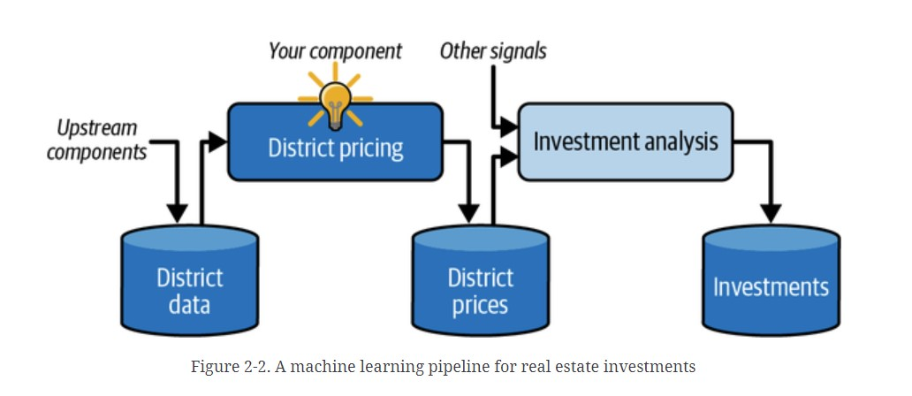
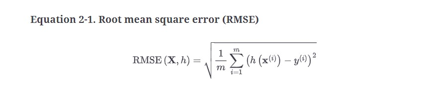
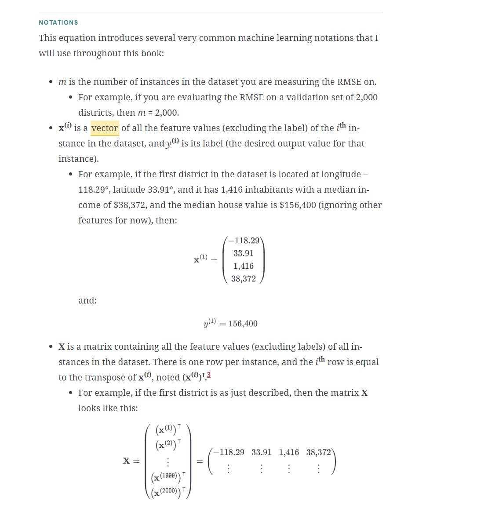
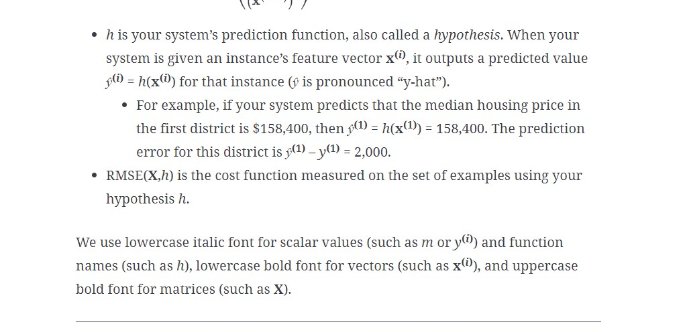
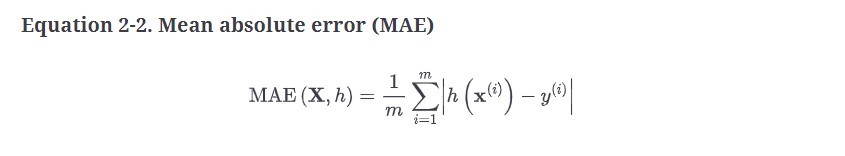
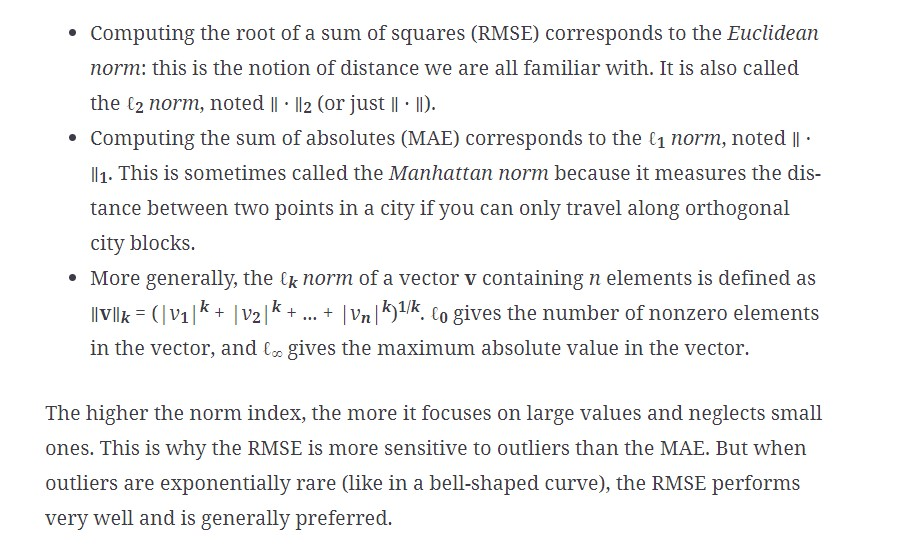

# Machine Leanring Project Checklist

## 1. Frame the Problem and Look at the big picture

**The first question to ask your boss is what exactly the business objective is**. Building a model is probably not the end goal. How does the company expect to use and benefit from this model? Knowing the objective is important because it will determine how you frame the problem, which algorithms you will select, which performance measure you will use to evaluate your model, and how much effort you will spend tweaking it.

**The next question to ask your boss is what the current solution looks like (if any)**. The current situation will often give you a reference for performance, as well as insights on how to solve the problem. Your boss answers that the district housing prices are currently estimated manually by experts: a team gathers up-to-date information about a district, and when they cannot get the median housing price, they estimate it using complex rules. This is costly and time-consuming, and their estimates are not great; in cases where they manage to find out the actual median housing price, they often realize that their estimates were off by more than 30%. This is why the company thinks that it would be useful to train a model to predict a district’s median housing price, given other data about that district. 

### 1.1 Explain the data pipeline

Components typically run asynchronously. Each component pulls in a large amount of data, processes it, and spits out the result in another data store. Then, some time later, the next component in the pipeline pulls in this data and spits out its own output. Each component is fairly self-contained: the interface between components is simply the data store. This makes the system simple to grasp (with the help of a data flow graph), and different teams can focus on different components. Moreover, if a component breaks down, the downstream components can often continue to run normally (at least for a while) by just using the last output from the broken component. This makes the architecture quite robust.

### 1.2 Making first decisions based on the initial understanding of the business object
With all this information, you are now ready to start designing your system. First, determine what kind of training supervision the model will need: is it a supervised, unsupervised, semi-supervised, self-supervised, or reinforcement learning task? And is it a classification task, a regression task, or something else? Should you use batch learning or online learning techniques?

Have you found the answers? Let’s see. This is clearly a typical supervised learning task, since the model can be trained with labeled examples (each instance comes with the expected output, i.e., the district’s median housing price). It is a typical regression task, since the model will be asked to predict a value. More specifically, this is a **multiple regression problem**, since the system will use multiple features to make a prediction (the district’s population, the median income, etc.). It is also a **univariate regression problem**, since we are only trying to predict a single value for each district. If we were trying to predict multiple values per district, it would be a **multivariate regression problem**. Finally, there is no continuous flow of data coming into the system, there is no particular need to adjust to changing data rapidly, and the data is small enough to fit in memory, so plain batch learning should do just fine.

### 1.3 Select a Performance Measure

#### Root Mean Square Error (RMSE)

Your next step is to select a performance measure. **A typical performance measure for regression problems is the root mean square error (RMSE)**. It gives an idea of how much error the system typically makes in its predictions, with a higher weight given to large errors.

#### Mean absolute error (MAE)

Although the RMSE is generally the preferred performance measure for regression tasks, in some contexts you may prefer to use another function. For example, if there are many outlier districts. In that case, you may consider using the mean absolute error (MAE, also called the average absolute deviation)

#### RMSE or MAE

### 1.4 Check the Assumptions
Lastly, it is good practice to list and verify the assumptions that have been made so far (by you or others); this can help you catch serious issues early on. For example, the district prices that your system outputs are going to be fed into a downstream machine learning system, and you assume that these prices are going to be used as such. But what if the downstream system converts the prices into categories (e.g., “cheap”, “medium”, or “expensive”) and then uses those categories instead of the prices themselves? In this case, getting the price perfectly right is not important at all; your system just needs to get the category right. If that’s so, then the problem should have been framed as a classification task, not a regression task. You don’t want to find this out after working on a regression system for months.

